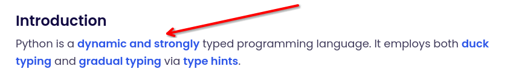
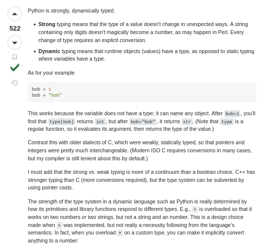
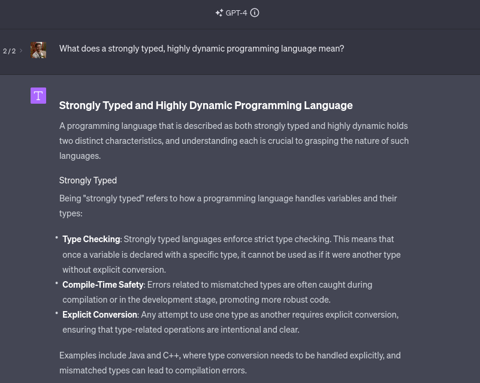
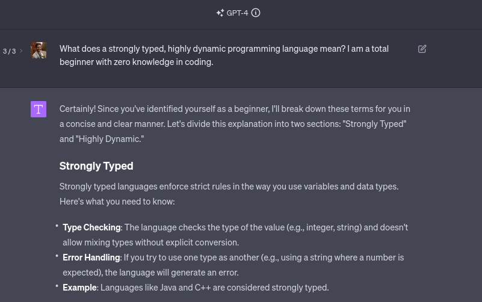
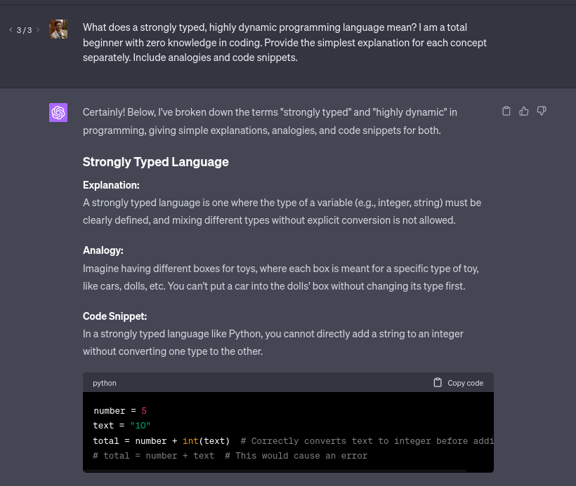
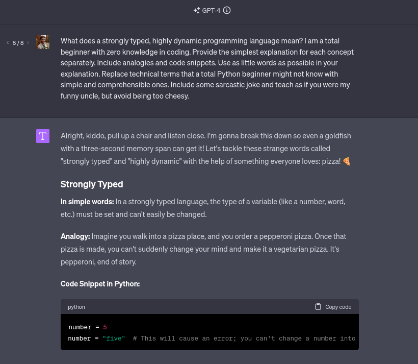
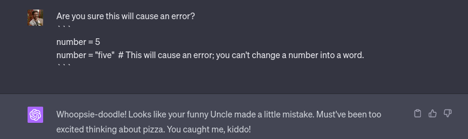

While learning to code, ChatGPT utilization should be split into 2 modes:

1. **The Conversationalist**
2. **The Hinter**

We use the **Conversationalist** to better understand the sea before sailing out through free discussion. 
This is the sea master that's available for us 24/7. We unleash our curiosities to him through conversation, seeking answers that could prove useful while we are at sea.

On the other hand, the **Hinter** accompanies you as you sail.

It's on your screen, alongside your code editor. It's not there to transform your newly crafted raft into a battleship you can't sail, but to offer small insights to help you move forward, saving precious time.

I will now quit the analogy and give you concrete examples.

### How to use the Conversationalist
Lets say you just began your coding journey as a total beginner, and you go to [Exercism](https://exercism.org/tracks/python/exercises). 

You finished the [Hello World tutorial](https://exercism.org/tracks/python/exercises/hello-world), and then moved on to [Guido's Gorgeous Lasagna learning exercise](https://exercism.org/tracks/python/exercises/guidos-gorgeous-lasagna).

Four words into the exercise, and you already don't understand what's going on. Sure, we could press on the [link](https://stackoverflow.com/questions/11328920/is-python-strongly-typed), skim through all the long StackOverflow answers and hopefully understand what "dynamic and strongly typed" means. 

The answer assumes we know what "data types" are, but we might be beginners who lack even that basic knowledge. Besides, the explanation is too long and we might not care about details like Perl. 

We could ignore it for now, close the tab, and get back to "dynamic and strongly typed programming languages" later. But should we?

I want to share my formula for understanding new ideas, even advanced ones, as you come across them using ChatGPT. I use this every day even now, so there's no skill cap and it's definitely not only for beginners.

So, let's try to use ChatGPT and ask him what the heck "dynamic and strongly typed" means.
### Example 1

> "Thx ChatGPT! It's worse than StackOverflow" - you utter. Working at Starbucks doesn't seem THAT bad of a choice anymore.

You're more confused than you started. Don't even think of asking what "compile-time safety" is.

Before you slam the `Alt + F4` combination, lets try changing the prompt a bit. 

### Example 2
Let's give ChatGPT some context about our current level of understanding:

> I am a total beginner with zero knowledge in coding.

> Congrats, you're no longer suicidal! 

We can make it even better. We were met with terms like `integers` and `strings`, but remember, we're complete n00bs.

### Example 3:
So, let's try to make this even simpler:

> Please provide the simplest explanation for each concept separately. Include analogies and code snippets.

Is the analogy not clear enough? No biggie, regenerate the response until you're satisfied. 

Remember, you're not seeking a perfect prompt, you're seeking understanding. 

You can now adjust the prompt as you like, based on your comfort level.
- Add crutches to reduce the feeling of being overwhelmed.
- Remove crutches to explore new concepts. 

### Example 4:
Lets try to have some fun with the instructions:

> - Use as little words as possible in your explanation.
> - Replace technical terms with simple and straightforward ones.
> - Include some sarcastic joke.
> - Teach as if you were my funny uncle, but avoid being too cheesy.

☑️ Preschooler-level explanation
☑️ 'Numbers' not `integers`
☑️ 'Words' not `strings`
☑️ Pizza
☑️ Clear code example
Monke brain understand 🐵!

### Maintaining Balance
To keep things simple, my system is the following:
- If ChatGPT's response includes **5 or more new concepts** for you, seek simpler explanations.
- If ChatGPT's response includes **only one or no new concepts** for you, seek more complex explanations.

#### Conversating
You also tend to remember best when you are also slightly interested and curious about what you're learning.

Make it a habit to always include follow-up questions. Don't be satisfied with the first response. You will often be amazed how good ChatGPT can be at teaching you conversational-style.

Ask questions such as:
- *{{concept}}* is still unclear to me. Can you further explain it in simple terms?
- I don't understand what *{{term}}* means. Can you explain?
- What is the point of *{{concept}}*. When will it be useful for me during my journey?

If we manage to accomplish all of these, the experience of learning will no longer be difficult, unproductive, discouraging and boring.

### Notes
ChatGPT is not perfect.

### Conclusion
1. ✅ **The process becomes easier** by getting answers that fit our current level of knowledge.
2. ✅ **We avoid suicidal thoughts** that were previously unavoidable when learning to code.
3. ✅ **We actually enjoy the process** by setting up ChatGPT to teach us in our preferred style.

ChatGPT is a tool. Use it wisely.
